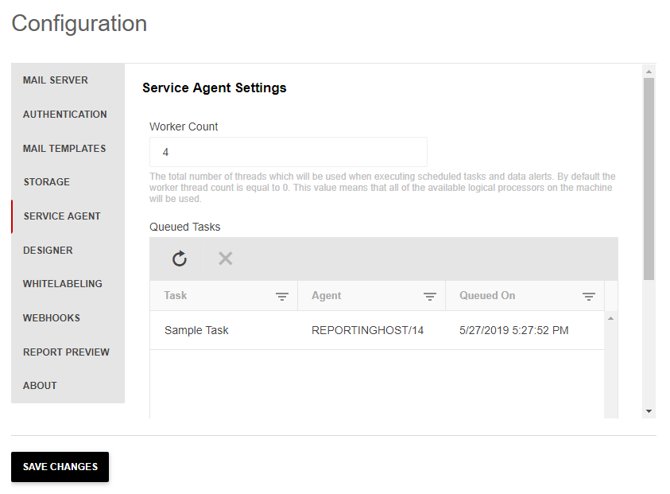

# Service Agent

The service agent is responsible for the execution of scheduled tasks and data alerts, and for sending e-mail messages. It runs its tasks on multiple worker threads to optimize execution performance. Also, the agent itself is able to run in a multiple instance environment.

## Worker Count

This is the total number of threads which will be used when executing scheduled tasks and data alerts. By default the worker thread count is equal to 0. This value means that all of the available logical processors on the machine will be used.

## Queued Tasks

The queued tasks grid shows all tasks which are currently queued for execution. It allows the user to cancel a selected task execution. The grid displays the name of the machine and worker thread which started the execution and the start date and time.

## Multiple-instance Service Agent

The service agent can operate in a multi-instance environment out of the box. The only requirement is that all Report Server instances should be configured to point to the same [storage](). In such environment each instance of the service agent will take as many tasks from the task queue at once as defined in the worker count setting.

>If the worker count setting is modified while multiple instances of the service agent are running it is required to restart all instances manually in order for the new setting to take effect.
