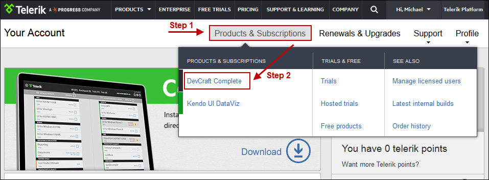
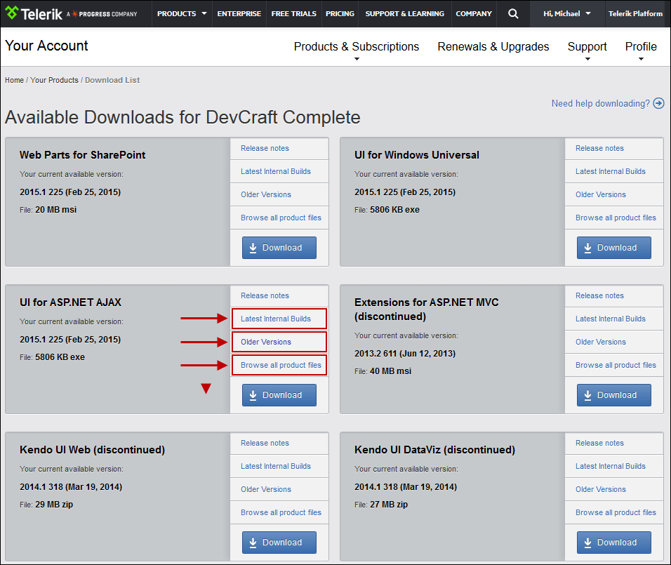

# Installation

The Report Server web application is installed by a Windows installer which automatically creates a separate web site with its own application pool on the IIS. The web site is registered on port 83 by default. The application pool is configured to use the *LocalSystem* identity. The installation process includes registering and starting a Scheduler Windows service named **Telerik.ReportServer.ServiceAgent**. 

## Downloading and Installing

You can download the licensed product version from the **Telerik Control Panel** which you can get from [Your Account](http://www.telerik.com/account). The Control Panel is a small Windows utility which will notify you when a new version of the Telerik product(s) you have purchased is available. Once you download the product, run the installer to install it on your machine.

## Installation Options

* The installation can be customized to include SDK examples in the installation folder and enable JSON dynamic compression for Report Server web site in IIS. These options can be selected from the *Customization* installer page when clicking the **Customize** button.
The SDK examples show how to implement a [custom login provider](../custom-login-provider) and how to use the [Telerik.ReportServer.HttpClient](../apis/rest-api/report-server-api-client) library to programmatically access Report Server assets and control the Report Server engine. The JSON dynamic compression is a feature that can lower the report loading times in Web Report Designer. See the [IIS Configuration](iis-configuration) article for more details or if you plan to do it manually later.
* The installer provides an option to choose whether the web site and the Windows service will be installed in 32-bit or 64-bit mode. The option is available only on 64-bit OS. It sets the option *Enable 32-Bit Applications* in the web site's application pool and registers the corresponding version of the **ServiceAgent** in Windows Services list. This configuraion option is useful when the Report Server and its Scheduling service need to work with a specific version of external entities like ODBC drivers without architecture mismatch between the driver and the application.

## New Versions

The best way is to download the Control Panel from [Your Account](http://www.telerik.com/account/):

It automatically detects the latest version and lets you install it for the products you have access to.

## Other Product Files and Latest Internal Builds

1. From [Your Account page](http://www.telerik.com/account/), go to “Products & Subscriptions” and select the product:

2. Hit the "Download" button:

3. From there select the product file you want to download:

## Backup

The Report Server storage contains all user assets like reports and scheduled tasks definitions. After a product upgrade, when the Report Server web manager application initially starts, there is a great chance that the Report Server storage schema gets changed as well. This is part of the product evolution and such schema changes get released with the major Report Server releases.

During product update or upgrade, the .msi installer package automatically performs a backup of the storage and approving this step in the install process is highly recommended in order to avoid any eventual data loss during the pending schema change. In order for the automatic backup to kick in, the current version of the product should be R2 2017 (3.1.17.503) or later (as this version introduced the necessary [storage migration tool](migration-tool)). If this is not the case, we still strongly encourage you to perform [manual backup of the storage](storage-backup#manual-backup) to eliminate any chance of data loss. 
