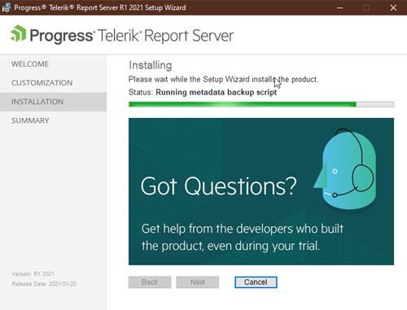
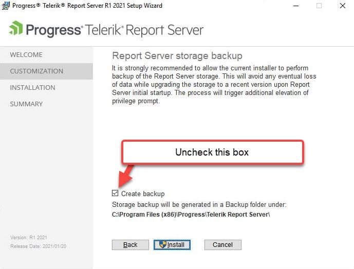
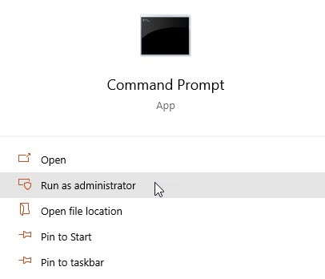

## Environment
<table>
	<tr>
		<td>Product</td>
		<td>Progress® Telerik® Report Server</td>
	</tr>
</table>

## Description

When upgrading an existing instance of the Report Server to a newer version, the installation appears to get stuck at the "Running metadata backup script" step.

Fig.1 - Stuck in the MSI installer



Fig.2 - Stuck in the Progress Control Panel


## Solutions

The backup step is performed by a PowerShell script. This script is invoked by a Command Prompt command which launches a new instance of PowerShell and passes in the args.

This means that if you have any custom commands inside a PowerShell profile (e.g. in your `$profile`) that will ask for user input, it will cause the Report Server backup stage to get stuck because you cannot see the window waiting for user input.

### Solution 1

The first option you have is to just disable running the backup script during the install/upgrade. You will find the option in the MSI installer's Customization options.



### Solution 2

If you want to run the backup script, then you can be proactive before running the Report Server installer by launching a PowerShell instance from an elevated Command Prompt. This will ensure that the commands will not await any input, and you can be confident in running the Report Server backup step.

1. Open **Command Prompt** as Administrator

    

2. Run the following command

    ```
    C:\Windows\SysWOW64\WindowsPowerShell\v1.0\powershell.exe -ExecutionPolicy Bypass
    ```
    
    If you see that user input is needed, complete those steps now and close the PowerShell instance.

3. Repeat Step 2 to confirm there is no longer any need for user input when a new instance in launched. 
4. Run the Report Server installer with backups enabled.
